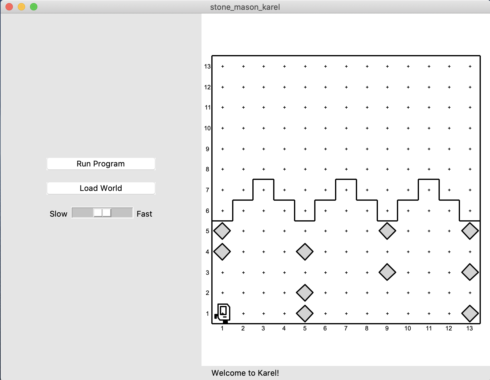
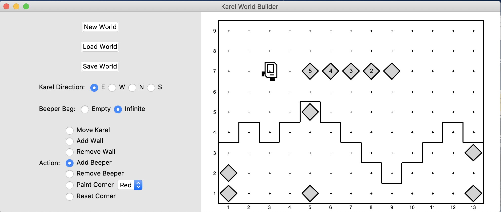
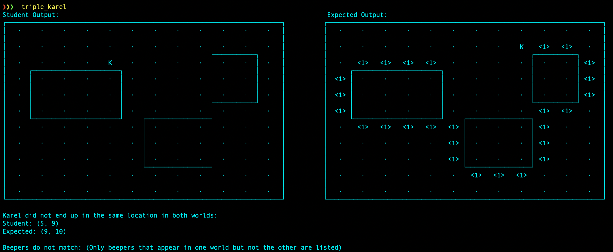

# stanford-karel

[](https://www.python.org/downloads/release/python-370/)
[](https://badge.fury.io/py/stanfordkarel)
[](https://github.com/TylerYep/stanfordkarel/actions/workflows/test.yml)
[](https://results.pre-commit.ci/latest/github/TylerYep/stanfordkarel/main)
[](https://github.com/TylerYep/stanfordkarel/blob/main/LICENSE)
[](https://pepy.tech/project/stanfordkarel)

This is a Python implementation of Karel for Stanford's CS 106A. This package is available on PyPI and allows you to run Karel programs without any additional setup!

Huge props to @nick-bowman for rewriting this project from scratch!

**StanfordKarel now supports:**

- Pip-installable package means you can run Karel programs from anywhere!
- Solution code no longer needed to grade assignments - instead, the output worlds are compared.
- Karel in ASCII! Plus autograder support.
- Improved autograding, testing, linting, and auto-formatting.
- Exception trace makes suggestions if you misspell a command (e.g. `turnLeft()` -> `turn_left()`).

# Usage

`pip install stanfordkarel`

# Documentation

Follow the Karel tutorial on the
[Karel Reader!](https://compedu.stanford.edu/karel-reader/docs/python/en/intro.html)

## Running Karel

First, ensure that StanfordKarel is correctly installed using pip.
Any `.py` file can become a Karel program!

**collect_newspaper_karel.py**

```python
from stanfordkarel import *


def main():
    """Karel code goes here!"""
    turn_left()
    move()
    turn_left()


if __name__ == "__main__":
    run_karel_program()
```

Save the file and run:

```
python collect_newspaper_karel.py
```



## Available Commands

| Karel Commands       |                        |                          |
| -------------------- | ---------------------- | ------------------------ |
| `move()`             | `right_is_clear()`     | `facing_east()`          |
| `turn_left()`        | `right_is_blocked()`   | `not_facing_east()`      |
| `put_beeper()`       | `beepers_present()`    | `facing_west()`          |
| `pick_beeper()`      | `no_beepers_present()` | `not_facing_west()`      |
| `front_is_clear()`   | `beepers_in_bag()`     | `facing_south()`         |
| `front_is_blocked()` | `no_beepers_in_bag()`  | `not_facing_south()`     |
| `left_is_clear()`    | `facing_north()`       | `paint_corner(color)`    |
| `left_is_blocked()`  | `not_facing_north()`   | `corner_color_is(color)` |

### Folder structure

You can set a default world by passing a world name to run_karel_program,
e.g. `run_karel_program("collect_newspaper_karel")`

Worlds should be saved/loaded in a `worlds/` folder in the same folder as the file being run.

- `assignment1/`
  - `worlds/` (additional worlds go here)
    - `collect_newspaper_karel.w`
    - `collect_newspaper_karel_end.w`
  - `collect_newspaper_karel.py`

## Creating Worlds

If using the pip-installed version, create a Python file containing:

```python
from stanfordkarel.world_editor import run_world_editor

if __name__ == "__main__":
    run_world_editor()
```

Then run `python world_editor.py`.



## Grading

`./autograde` runs the available tests using pytest in the `tests/` folder and prints out any output differences in the world.

### Functionality

The tests use the student's code and the expected world output to determine correctness. If the output is not the same, the test driver will print out an ASCII representation of the differences.



### Style

The autograde command also runs the builtin Karel Style Checker that performs linting automatically.

## Development

Everything important is located in `stanfordkarel/`.

- Python 3.5+ is required because of `importlib.util.module_from_spec`.
- Python 3.6+ is required for f-strings.
- Python 3.7+ is required for type annotations.
- `stanfordkarel/` is the exported package, which contains all of the available functions and commands for students to use.
- `karel_application.py` is responsible for loading student code and displaying it to the screen.

# Contributing

All issues and pull requests are much appreciated!

- First, run `pip install pre-commit` and `pre-commit install`.
- To see test coverage scripts and other auto-formatting tools, use `pre-commit run`.
- To run all tests, run `pytest`.

## Future Milestones

In the future, I hope to add:

- Automatic student style checking
- Ways of determining the student's strategy or approach from observing Karel movements
- Autograde more worlds, broken down by assignment
- Allow students to autograde their own work
- Accessibility for visually-impaired students
